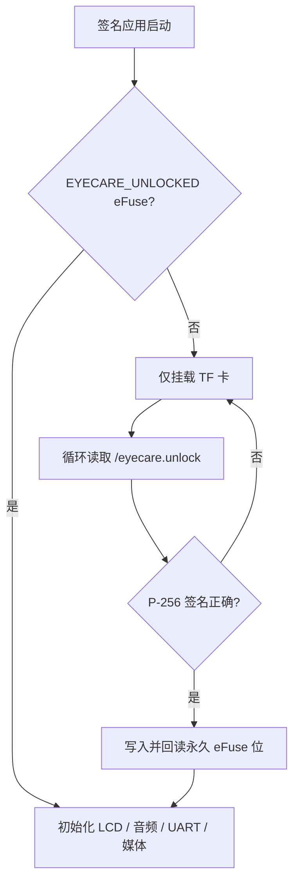
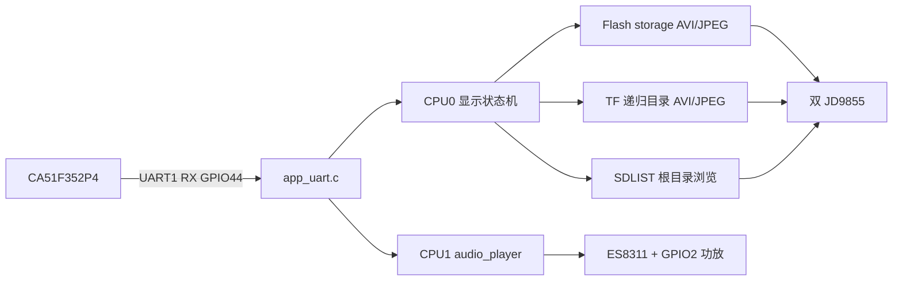
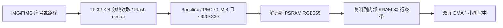

# ESP32-S3 眼保仪媒体与生产启动链路

当前代码基准：ESP-IDF v5.4.4，YT06 V1.1，双 320×320 JD9855。更细的事实表见仓库根目录 `CURRENT_IMPLEMENTATION.md`。

## 启动入口

生产锁只由 `sdkconfig.production.defaults` 启用；开发构建直接进入应用。私钥不在 TF 卡和固件中，TF 卡只有由解锁私钥签名的通用授权令牌（不绑定设备，可解锁所有设备）。生产内容保密依赖 Secure Boot V2 与 Release 模式 Flash Encryption，详见 `SECURITY_PROVISIONING.md`。

## 总体媒体链路

视频和图片共享 LCD，彼此互斥；音频独立，可与视频或图片并行。系统不做音画时间轴同步。

## 视频

| 链路 | 输入 | 缓冲与 DMA | 调度 |
|---|---|---|---|
| Flash `VPLAY` | `storage` FAT 索引，mmap AVI/MJPEG | PSRAM 双帧；2 个内部 SRAM 40 行条带 | CPU0 解码，1 ms 服务 |
| TF `VID` | 递归解析相对路径，32 KiB FatFS 流读取 | PSRAM 双帧；1 个内部 SRAM 160 行条带 | CPU0 解码，1 ms 服务 |

两条链路均解析 RIFF/AVI、只显示 MJPEG 图像，并跳过 AVI 音频块。TF 视频尺寸不得超过 320×320。PSRAM 帧不能直接提交 LCD DMA，必须同步 cache 后复制到内部 SRAM 条带。

## 图片

`IMGLIST` 递归扫描 TF 子目录；`FIMGLIST` 使用 Flash 媒体索引。Progressive JPEG 不支持。

## 音频

`ALIST`/`APLAY` 递归选择 TF 卡 `.pcm/.mp3`。PCM 约定 16-bit、单声道、16 kHz；MP3 由 micro-mp3 解码。CPU1 独立任务将源采样率线性重采样至 ES8311 输出链路，I2S0 使用 MCLK45/BCLK39/WS41/DOUT42，GPIO2 高电平开启功放。

## 目录规则

- `VIDLIST`、`IMGLIST`、`ALIST` 递归遍历挂载点，返回 UTF-8 相对路径；序号随 FAT 遍历结果变化。
- `VID`、`IMG`、`APLAY` 接受序号或相对路径，稳定产品配置宜使用路径。
- `SDLIST` 是独立 LCD 浏览器，目前只显示 TF 根目录。
- 转换脚本是 `tools/linux/convert_mp4_to_avi.sh`，不是旧的 `tools/convert.sh`。
