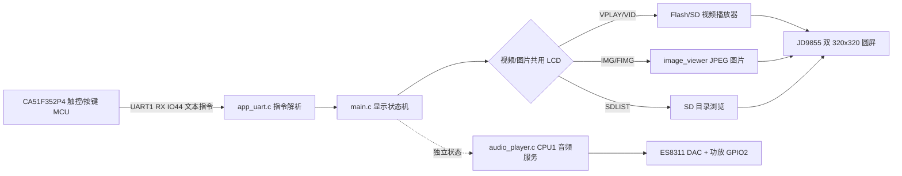
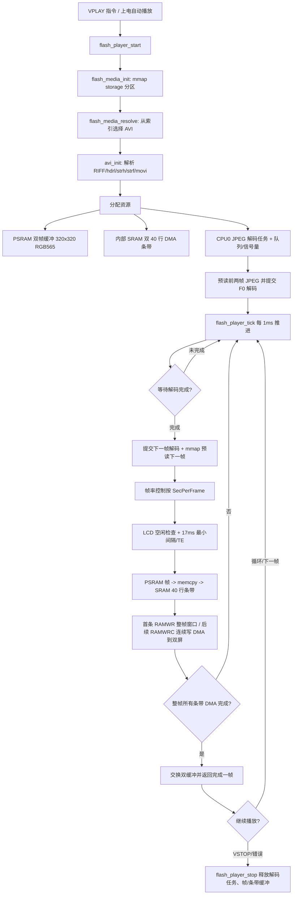
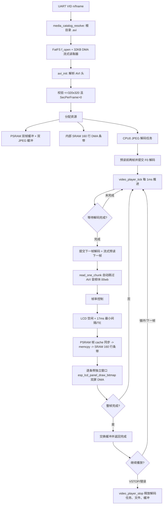
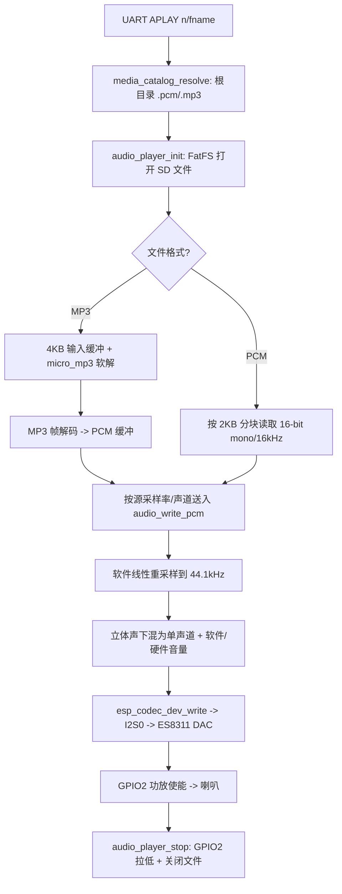
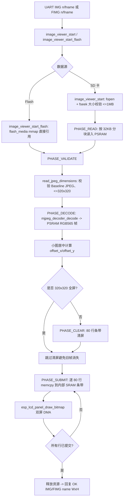
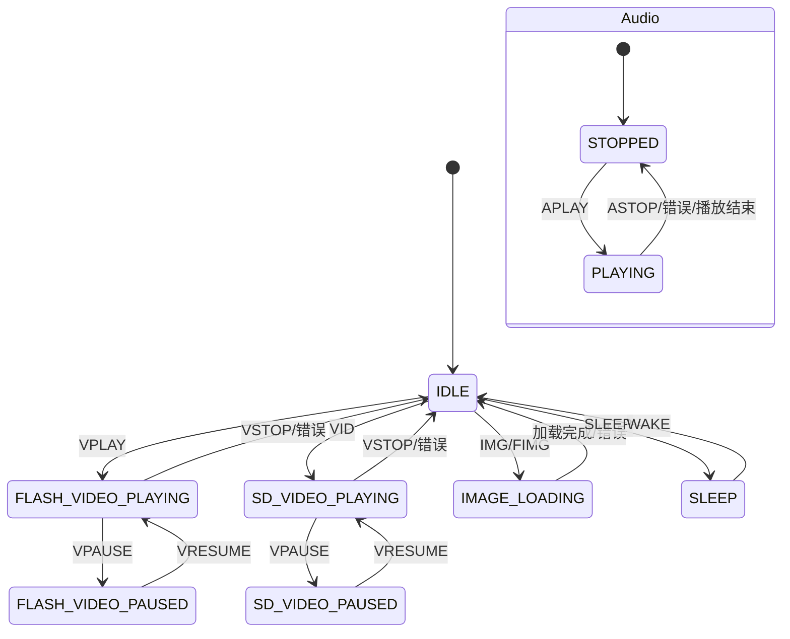

# ESP32-S3 眼保仪媒体链路 Archify 流程图

> 本文梳理项目内视频、音频、图像三条媒体链路，作为 `info/Map` 下的 Archify 流程图索引。
> 代码位置：`main/flash_player.c`、`main/video_player.c`、`main/audio_player.c`、`main/audio.c`、`main/image_viewer.c`、`main/mjpeg.c`、`main/avi.c`。

## 0. 总体链路

- 存储分工：Flash `storage` 分区（FAT 子类型，mmap 索引）存 AVI/JPEG；SD 卡存 MJPEG AVI、PCM/MP3、JPEG。
- CPU 分工：Flash/TF JPEG 解码固定 CPU0；音频服务固定 CPU1，5 ms tick。
- 显示互斥：视频与图片共用 LCD，二者互斥；音频与显示相互独立，`APLAY` 可与 `VID`/`IMG` 同时运行。

## 1. 视频链路

### 1.1 Flash AVI 视频（`VPLAY`，主力）

### 1.2 SD 卡 MJPEG AVI 视频（`VID`）

要点：
- Flash 视频从 mmap 分区零拷贝读取，不占 SPI2/SDMMC 总线。
- SD 视频使用 FatFS + DMA 读取；AVI 内嵌音频块不播放，只跳过。
- 禁止 PSRAM 直接 DMA 到 LCD；必须先 `memcpy` 到内部 SRAM DMA 条带，再提交 LCD。

## 2. 音频链路

要点：
- 音频服务在 CPU1 独立 FreeRTOS 任务中运行，5 ms tick；不受主循环 workspace 阻塞。
- ES8311/I2S 固定 44.1 kHz / 16-bit / mono；PCM 16 kHz、MP3 8–48 kHz 均在 CPU1 内线性重采样。
- `AMUTE` 直接拉低 GPIO2 功放使能；`VOL` 默认写 ES8311 I2C 音量寄存器（也可切换为软件 PCM 缩放）。
- 音频与视频/图片无时间轴同步，`APLAY` 可与显示播放并行。

## 3. 图像链路

要点：
- 图片仅支持 Baseline `.jpg/.jpeg`、文件 ≤1 MiB、解码尺寸 ≤320×320；小图居中显示。
- 解码帧在 PSRAM，LCD 只接收内部 SRAM 80 行 DMA 条带。
- `IMG`/`FIMG` 会停止当前视频/图片显示，但不会停止音频。

## 4. 状态机与命令速查

主要命令映射：

| 命令 | 入口函数 | 媒体链路 |
|---|---|---|
| `VPLAY [n/fname]` | `flash_player_start` | Flash AVI 视频 |
| `VID [n/fname]` | `video_player_start` | SD 卡 MJPEG AVI |
| `VPAUSE` / `VRESUME` / `VSTOP` | `g_display_mode` 切换 / player stop | 视频控制 |
| `APLAY [n/fname]` | `audio_player_start` | SD 卡 PCM/MP3 |
| `ALIST` / `ASTOP` / `AMUTE` / `VOL` | `audio_player_*` | 音频控制 |
| `IMG [n/fname]` | `image_viewer_start` | SD 卡 JPEG |
| `FIMG [n/fname]` | `image_viewer_start_flash` | Flash JPEG |
| `SDLIST [page]` | `sd_browser_show_page` | SD 目录浏览 |

## 5. 相关文件

| 模块 | 文件 | 职责 |
|---|---|---|
| 主循环/调度 | `main/main.c` | 1ms tick、5 workspace、显示/音频状态机 |
| UART 控制 | `main/app_uart.c/h` | 接收 CA51 指令、分发播放器调用 |
| Flash 媒体索引 | `main/flash_media.c/h` | mmap storage 分区、AVI/JPEG 条目解析 |
| Flash 视频 | `main/flash_player.c/h` | Flash AVI tick 播放器 |
| SD 视频 | `main/video_player.c/h` | SD MJPEG AVI 双核流水线播放器 |
| 音频 | `main/audio_player.c/h` + `main/audio.c/h` | PCM/MP3 播放、重采样、ES8311 驱动 |
| 图片 | `main/image_viewer.c/h` | SD/Flash JPEG 分块读取与条带显示 |
| 解码 | `main/mjpeg.c/h` | JPEG/MJPEG 解码封装（esp_new_jpeg/esp_jpeg） |
| AVI 解析 | `main/avi.c/h` | RIFF/movi/strh/strf 解析 |
